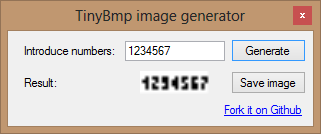

TinyBmp
==============
A small project for generating a tiny bitmap image from some numbers.

TinyBmpLib
-------------
The lib that does the magic.
 
TinyBmp
-------------

A desktop app that shows a preview of the generated image.

DataWriterConsole
-------------
A console app for automating the generation of images.

* First parameter: Number to print
* Second parameter: output file